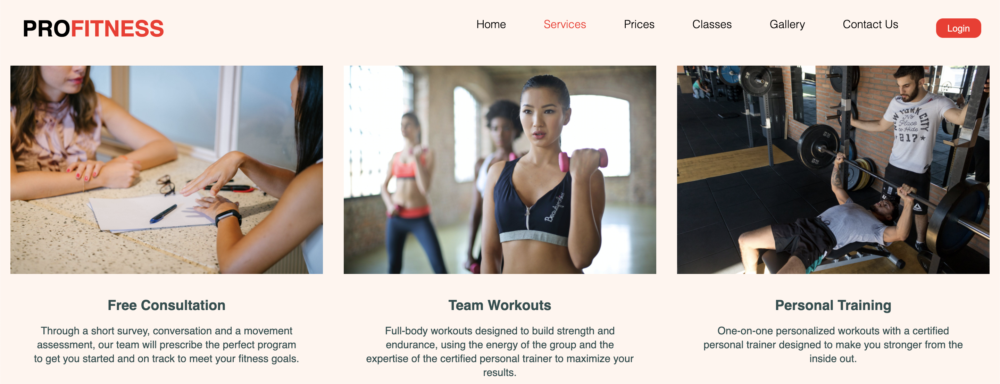

<h1>PRO FITNESS</h1>

[View the live project here.](https://birchm93.github.io/Project/index.html)

Milestone Project 1: User-Centric Frontend Development - Code Institute

The purpose of my project is to design a fictional gym website, to attract new members and existing members.

<h2 align="center"></h2>

## User Experience (UX)

-   ### Strategy
    The overall aim is to attract new members and retention of existing members.
    The website will enable users to find important information with regards to the location, fees, opening hours, getting in contact and class timetables

-   ### User stories

    -  As a new visitor to the website, I want to easily navigate the site, so I can find what I need.
    -  As an interested client, I want an easy to fill in enquiry form, so I can make contact with the gym.
    -  As a new visitor to the website, I want learn more about the gym.
    -  As a new and potential client, I want information about gym memberships rates.
    -  As an interested client, I want an easy to fill in enquiry form.
    -  As an interested current/or potential client, I want to follow the gym on social media, so I can keep up with their latest news.
    -  As a potential/current client, I want to check the class timetables.
    -  As a new/current client, I want to know what classes are on offer.
    -  As a new and potential client, I want to get in contact with the gym, so that I can ask more specific questions with a representative of the gym.
    -  As a potential/current client, I want to check the opening times.
    -  As a current client, I want to get contact information, so i can ask a question about my membership
    -  As a current client, I want to know the location of the gym.

-   ### Design
    -   #### Colour Scheme
        -   The main colours used are seashell, red and grey.
    -   #### Imagery
        -   Hero image is designed to be striking and catch the user's attention.
        -   Services section consist of 3 stock images with a brief description of each.
        -   Gallery section consists of images which displays the facilties of the gym.

*   ### Wireframes

    -   Home - [View](https://github.com/BirchM93/Project/blob/master/assets/wireframes/Home%20Page.png)
    -   Services - [View](https://github.com/BirchM93/Project/blob/master/assets/wireframes/Services%20Page.png)
    -   Prices - [View]()
    -   Contact Us - [View]()
    -   Login Page - [View]()
    -   Mobile View - [View]()

## Features

-   #### Navbar  
    

    -   Allows users to click on each of the links in the navbar which will take them to the section they require.
    -   Login button will take you to the login page (more info on Login Page feature).
    -   By clicking on the logo on the left hand side will bring you back to the home page.

-   #### Home Page   
      

    -   Consists of a hero image along with a brief overview.

-   #### Services Page  
    

    -   Consists of three stock images along with a brief description below each image.
    -   Overview of what services are provided.

-   #### Price Packages Page
    

    - Three sepeate packages provided with a description in each along with a Join Now button feature. 

-   #### Contact Us Page   
     

    -   Created a contact form with a submit button.
    -   Users can also get in contact via social media links displayed with icons.
    -   Opening hours, location and address are displayed along with icons.
    -   Footer included at the bottom of the page.

-   #### Login Page
    

    -   Brings you to a new seperate page when login button is clicked on the main page.
    -   Consists of a login box, an avatar image at the top and a Login button feature.
    -   Prompts existing members to login with their registered username and password.
    -   Existing members who don't have an account can click below the Login button to create a new account if they wish and also reset passwords if needed.
    -   By clicking "Back to Home" on the top left of the page you will be brought back to the home page.

-   #### Hamburger menu
     
    

    -   Navigation menu will collapse into a hamburger menu icon on smaller screens such as tablets and mobile phones to make it user friendly and appealing.
    -   When the hamburger menu icon is clicked a drop down menu will appear with the navbar items.

    
## Technologies Used

### Languages Used

-   [HTML5](https://en.wikipedia.org/wiki/HTML5)
-   [CSS3](https://en.wikipedia.org/wiki/Cascading_Style_Sheets)
-   [Javascript](https://en.wikipedia.org/wiki/JavaScript)

### Frameworks, Libraries & Programs Used

1. [Bootstrap 4.4.1:](https://getbootstrap.com/docs/4.4/getting-started/introduction/)
    - Bootstrap was used to assist with the responsiveness and styling of the website.
1. [Font Awesome:](https://fontawesome.com/icons?d=gallery)
    - Font Awesome was used to add icons for UX purposes.
1. [GitHub:](https://github.com/)
    - GitHub is used to store the projects code after being pushed from Git.
1. [Mockflow](https://mockflow.com) and [Balsamiq:](https://balsamiq.com/)
    - Mockflow & Balsamiq were used to create wireframes during the design process.

## Testing

### Code Validation
-   [W3C Markup Validator](https://validator.w3.org/) - One error appeared for the index file but it did not affect the end result whatsoever 
-   [W3C CSS Validator](https://jigsaw.w3.org/css-validator/#validate_by_input) - No errors found.
-   [Esprima Javascript Validator](https://esprima.org/demo/validate.html) - Code is valid.

### Further Testing

-   This website was tested on Google Chrome, Internet Explorer, Firefox and Safari browsers.
-   This website was viewed on a variety of devices such as Desktop, Laptop and Google Developer Tools (mobile devices, iPad).
-   Friends and family members were asked to review the site and documentation to point out any user experience issues.

## Deployment

### GitHub Pages

The project was deployed to GitHub Pages using the following steps...

1. Log in to GitHub and locate the [GitHub Repository](https://github.com/BirchM93/Project)
2. At the top of the Repository (not top of page), locate the "Settings" Button on the menu.
3. Scroll down the Settings page until you locate the "GitHub Pages" Section.
4. Under "Source", click the dropdown called "None" and select "Master Branch".
5. The page will automatically refresh.
6. Scroll back down through the page to locate the now published site [link](https://birchm93.github.io/Project/) in the "GitHub Pages" section.

### Making a Local Clone

1. Log in to GitHub and locate the [GitHub Repository](https://github.com/BirchM93/Project)
2. Under the repository name, click "Clone or download".
3. To clone the repository using HTTPS, under "Clone with HTTPS", copy the link.
4. Open Git Bash
5. Change the current working directory to the location where you want the cloned directory to be made.
6. Type `git clone`, and then paste the URL you copied in Step 3.
7. Press Enter. Your local clone will be created.

## Credits

### Content

-  Home Page - [link](https://www.youtube.com/watch?v=kqs44JNz9gk&frags=pl%2Cwn)
                [link](https://www.youtube.com/watch?v=VncGOVEKSvA&t=273s)
                          [link](https://www.youtube.com/watch?v=-03iS4qcr3k&t=1s)
                          [link](https://www.youtube.com/watch?v=EB9YL7l_Ei0&t=739s) 

-  User Login Page - [view](https://www.youtube.com/watch?v=OWNxUVnY3pg)

-  Responsive Navbar/Hamburger menu - [view](https://www.youtube.com/watch?v=At4B7A4GOPg&t=343s)

### Media

-   [Hero image](https://drive.google.com/drive/folders/1iqUFKsR5cO9CMF03a8i-COrBHNBv5BEG)

-   [Service descriptions](https://www.anytimefitness.com/training/)

-   [Services stock images](https://www.pexels.com/) 

-   [Login avatar](https://www.flaticon.com/)

-   [Social media icons](https://www.w3schools.com/icons/fontawesome_icons_brand.asp)

-   [Contact us icons](https://fontawesome.com/icons?d=gallery)

### Acknowledgements

-   My Mentor for continuous helpful feedback.

-   Tutor support at Code Institute for their support.